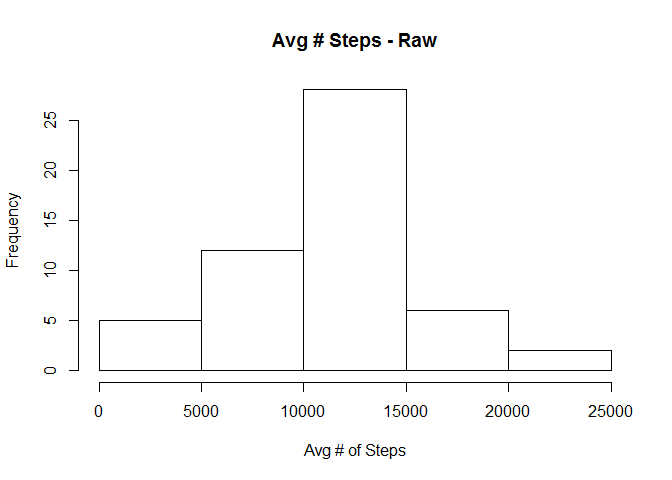
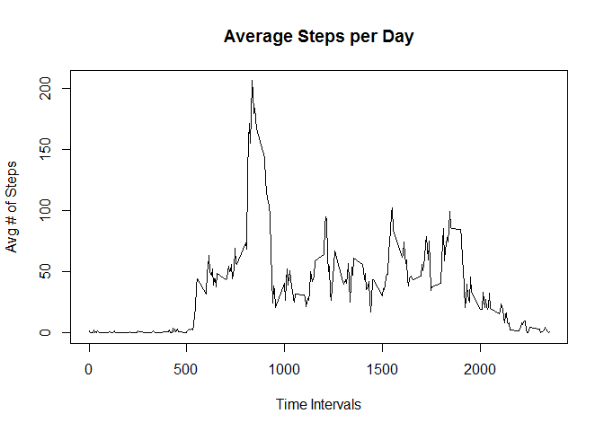
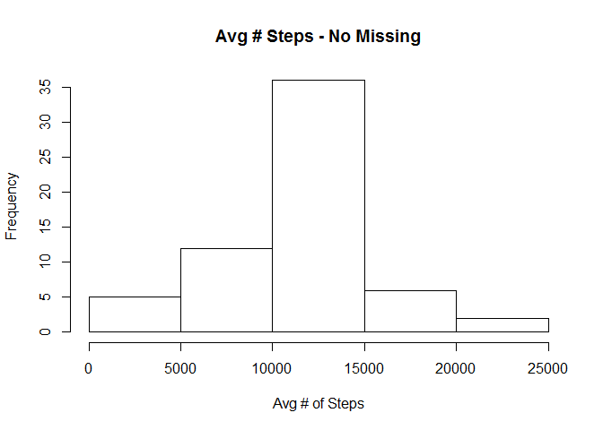
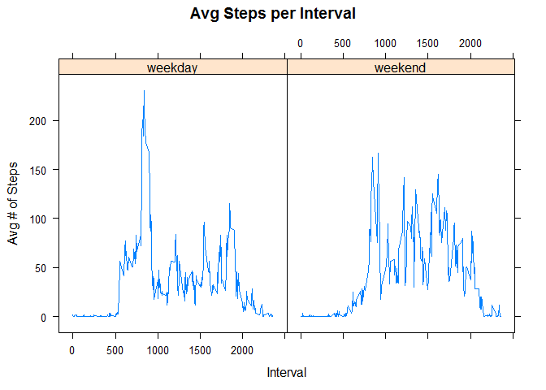

# Reproducible Research: Peer Assessment 1


## Loading and preprocessing the data

```r
dRaw <- read.csv(".\\activity\\activity.csv")  
colnames(dRaw) <- c("steps", "date", "interval")  
### get data without missing values into d
d <- dRaw[!is.na(dRaw$steps),]  
```

## What is mean total number of steps taken per day?

```r
### get the number of steps taken each day into dSteps
dSteps<-aggregate(d$steps, by=list(d$date), FUN=sum)  
colnames(dSteps) <- c("date", "numSteps")  
### histogram of number of steps
hist(dSteps$numSteps, xlab="Avg # of Steps", main="Avg # Steps - Raw")  
```

\

```r
### mean and median of number of steps per day  
meanSteps <- aggregate(d$steps, by=list(d$date), FUN=mean)      
medianSteps <- aggregate(d$steps, by=list(d$date), FUN=median)  
mmSteps <- cbind(meanSteps, medianSteps["x"])  
colnames(mmSteps) <- c("date", "mean", "median")  
mmSteps  
```

```
##          date       mean median
## 1  2012-10-02  0.4375000      0
## 2  2012-10-03 39.4166667      0
## 3  2012-10-04 42.0694444      0
## 4  2012-10-05 46.1597222      0
## 5  2012-10-06 53.5416667      0
## 6  2012-10-07 38.2465278      0
## 7  2012-10-09 44.4826389      0
## 8  2012-10-10 34.3750000      0
## 9  2012-10-11 35.7777778      0
## 10 2012-10-12 60.3541667      0
## 11 2012-10-13 43.1458333      0
## 12 2012-10-14 52.4236111      0
## 13 2012-10-15 35.2048611      0
## 14 2012-10-16 52.3750000      0
## 15 2012-10-17 46.7083333      0
## 16 2012-10-18 34.9166667      0
## 17 2012-10-19 41.0729167      0
## 18 2012-10-20 36.0937500      0
## 19 2012-10-21 30.6284722      0
## 20 2012-10-22 46.7361111      0
## 21 2012-10-23 30.9652778      0
## 22 2012-10-24 29.0104167      0
## 23 2012-10-25  8.6527778      0
## 24 2012-10-26 23.5347222      0
## 25 2012-10-27 35.1354167      0
## 26 2012-10-28 39.7847222      0
## 27 2012-10-29 17.4236111      0
## 28 2012-10-30 34.0937500      0
## 29 2012-10-31 53.5208333      0
## 30 2012-11-02 36.8055556      0
## 31 2012-11-03 36.7048611      0
## 32 2012-11-05 36.2465278      0
## 33 2012-11-06 28.9375000      0
## 34 2012-11-07 44.7326389      0
## 35 2012-11-08 11.1770833      0
## 36 2012-11-11 43.7777778      0
## 37 2012-11-12 37.3784722      0
## 38 2012-11-13 25.4722222      0
## 39 2012-11-15  0.1423611      0
## 40 2012-11-16 18.8923611      0
## 41 2012-11-17 49.7881944      0
## 42 2012-11-18 52.4652778      0
## 43 2012-11-19 30.6979167      0
## 44 2012-11-20 15.5277778      0
## 45 2012-11-21 44.3993056      0
## 46 2012-11-22 70.9270833      0
## 47 2012-11-23 73.5902778      0
## 48 2012-11-24 50.2708333      0
## 49 2012-11-25 41.0902778      0
## 50 2012-11-26 38.7569444      0
## 51 2012-11-27 47.3819444      0
## 52 2012-11-28 35.3576389      0
## 53 2012-11-29 24.4687500      0
```

## What is the average daily activity pattern?

```r
### time series plot of the average steps taken per day
dAvgStepsInt<-aggregate(d$steps, by=list(d$interval), FUN=mean)  
colnames(dAvgStepsInt) <- c("interval", "avgSteps")  
plot(x = dAvgStepsInt$interval, y = dAvgStepsInt$avgSteps, type="l"  
      , xlab="Time Intervals"  
      , ylab="Avg # of Steps"  
      , main = "Average Steps per Day")  
```

\

```r
### which interval has the max number of steps?
### NOTE: rounding to 5 digits so that we can get exact match without rounding errors
dAvgStepsInt<- cbind(dAvgStepsInt, avgRnd=round(dAvgStepsInt$avgSteps, digits =5))  
colnames(dAvgStepsInt) <- c("interval", "avgSteps", "avgRnd")  
maxInterval <- subset(dAvgStepsInt, avgRnd == round(max(dAvgStepsInt$avgSteps), digits=5))  
print(maxInterval["interval"])  
```

```
##     interval
## 104      835
```

## Imputing missing values

```r
### number of missing values
missing <- dRaw[is.na(dRaw$steps),]  
colnames(missing) <- c("steps", "date", "interval")  
nrow(missing)  
```

```
## [1] 2304
```

```r
### fill in the missing values with the mean for that interval
### get the set of missing values, and merge with mean for the interval
merged<- merge(missing, dAvgStepsInt, by.x="interval", by.y="interval")  
missingFilled <- subset(merged, select=c("avgSteps","date", "interval"))  
colnames(missingFilled) <- c("steps", "date", "interval")  
### bind our dataset without missing values, with the set of values we filled in that were missing
fullD <- rbind(d, missingFilled)  
colnames(fullD) <- c("steps", "date", "interval")  
fullDSum<-aggregate(fullD$steps, by=list(fullD$date), FUN=sum)  
colnames(fullDSum) <- c("date", "steps")  
### draw graph in png
hist(fullDSum$steps, xlab="Avg # of Steps", main="Avg # Steps - No Missing")  
```

\

```r
### mean and median of number of steps per day
meanStepsFull <- aggregate(fullD$steps, by=list(fullD$date), FUN=mean)      
medianStepsFull <- aggregate(fullD$steps, by=list(fullD$date), FUN=median)  
mmStepsFull <- cbind(meanStepsFull, medianStepsFull["x"]) 
colnames(mmStepsFull) <- c("date", "mean", "median")  
mmStepsFull  
```

```
##          date       mean   median
## 1  2012-10-01 37.3825996 34.11321
## 2  2012-10-02  0.4375000  0.00000
## 3  2012-10-03 39.4166667  0.00000
## 4  2012-10-04 42.0694444  0.00000
## 5  2012-10-05 46.1597222  0.00000
## 6  2012-10-06 53.5416667  0.00000
## 7  2012-10-07 38.2465278  0.00000
## 8  2012-10-08 37.3825996 34.11321
## 9  2012-10-09 44.4826389  0.00000
## 10 2012-10-10 34.3750000  0.00000
## 11 2012-10-11 35.7777778  0.00000
## 12 2012-10-12 60.3541667  0.00000
## 13 2012-10-13 43.1458333  0.00000
## 14 2012-10-14 52.4236111  0.00000
## 15 2012-10-15 35.2048611  0.00000
## 16 2012-10-16 52.3750000  0.00000
## 17 2012-10-17 46.7083333  0.00000
## 18 2012-10-18 34.9166667  0.00000
## 19 2012-10-19 41.0729167  0.00000
## 20 2012-10-20 36.0937500  0.00000
## 21 2012-10-21 30.6284722  0.00000
## 22 2012-10-22 46.7361111  0.00000
## 23 2012-10-23 30.9652778  0.00000
## 24 2012-10-24 29.0104167  0.00000
## 25 2012-10-25  8.6527778  0.00000
## 26 2012-10-26 23.5347222  0.00000
## 27 2012-10-27 35.1354167  0.00000
## 28 2012-10-28 39.7847222  0.00000
## 29 2012-10-29 17.4236111  0.00000
## 30 2012-10-30 34.0937500  0.00000
## 31 2012-10-31 53.5208333  0.00000
## 32 2012-11-01 37.3825996 34.11321
## 33 2012-11-02 36.8055556  0.00000
## 34 2012-11-03 36.7048611  0.00000
## 35 2012-11-04 37.3825996 34.11321
## 36 2012-11-05 36.2465278  0.00000
## 37 2012-11-06 28.9375000  0.00000
## 38 2012-11-07 44.7326389  0.00000
## 39 2012-11-08 11.1770833  0.00000
## 40 2012-11-09 37.3825996 34.11321
## 41 2012-11-10 37.3825996 34.11321
## 42 2012-11-11 43.7777778  0.00000
## 43 2012-11-12 37.3784722  0.00000
## 44 2012-11-13 25.4722222  0.00000
## 45 2012-11-14 37.3825996 34.11321
## 46 2012-11-15  0.1423611  0.00000
## 47 2012-11-16 18.8923611  0.00000
## 48 2012-11-17 49.7881944  0.00000
## 49 2012-11-18 52.4652778  0.00000
## 50 2012-11-19 30.6979167  0.00000
## 51 2012-11-20 15.5277778  0.00000
## 52 2012-11-21 44.3993056  0.00000
## 53 2012-11-22 70.9270833  0.00000
## 54 2012-11-23 73.5902778  0.00000
## 55 2012-11-24 50.2708333  0.00000
## 56 2012-11-25 41.0902778  0.00000
## 57 2012-11-26 38.7569444  0.00000
## 58 2012-11-27 47.3819444  0.00000
## 59 2012-11-28 35.3576389  0.00000
## 60 2012-11-29 24.4687500  0.00000
## 61 2012-11-30 37.3825996 34.11321
```

## Are there differences in activity patterns between weekdays and weekends?

```r
### convert to proper date format
fullD["date"] <- as.Date(fullD$date, format = "%Y-%m-%d")  
fullDWeek <- cbind(fullD, wd = weekdays(fullD$date), wdf = weekdays(fullD$date))  
### function to identify weekday
fn_IsWeekday <- function(x){  
  f<- "0"  
  if(x == "Monday" || x== "Tuesday" || x== "Wednesday" || x== "Thursday" || x== "Friday"){  
    f<-"1"  
  }  
  f  
}  
### identify weekends and weekdays
fullDWeek["wdf"] <- apply(fullDWeek["wdf"], 1, fn_IsWeekday)  
### create a factor variable for weekdays and weekends
fullDWeek["wdf"] <- factor(fullDWeek$wdf, level=c(1,0), labels = c("weekday", "weekend"))  
### get the avg number of steps for weekends and weekdays into fullDWeekAvg
fullDWeekAvg <- aggregate(fullDWeek$steps, by=list(fullDWeek$wdf, fullDWeek$interval), mean)  
colnames(fullDWeekAvg) <- c("wdf", "interval", "avgSteps")  
### plot Average Num of Steps for Weekdays and Weekends on the same device
library("lattice")  
xyplot(as.numeric(fullDWeekAvg$avgSteps) ~ as.numeric(fullDWeekAvg$interval) | fullDWeekAvg$wdf  
       , panel=panel.xyplot, type="l"  
       , main="Avg Steps per Interval"  
       , ylab="Avg # of Steps"  
       , xlab="Interval")  
```

\

